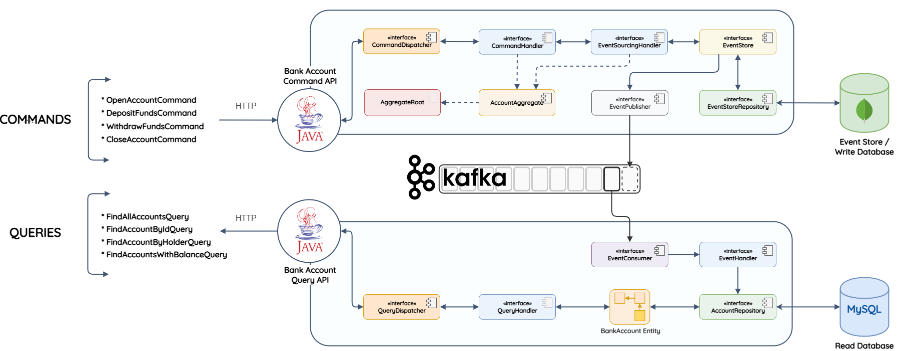
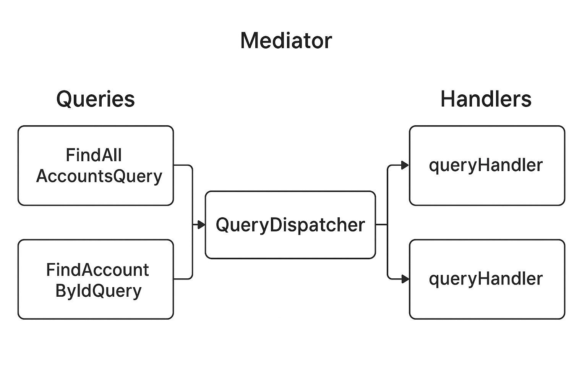

# Java Microservices CQRS & Event Sourcing with Kafka

A production-ready implementation of the **CQRS (Command Query Responsibility Segregation)** and **Event Sourcing** patterns using Spring Boot microservices, powered by Apache Kafka for event streaming and polyglot persistence.

## 📋 Table of Contents

- [Overview](#overview)
- [Architecture](#architecture)
- [Key Concepts](#key-concepts)
- [Project Structure](#project-structure)
- [Technologies](#technologies)
- [Design Patterns](#design-patterns)
- [Getting Started](#getting-started)
- [API Endpoints](#api-endpoints)
- [Event Flow](#event-flow)

---

## 🎯 Overview

This project demonstrates a banking system that separates read and write operations into distinct microservices, following CQRS principles. All state changes are persisted as a sequence of events (Event Sourcing), enabling complete audit trails, temporal queries, and the ability to reconstruct system state at any point in time.

### Why CQRS + Event Sourcing?

- **Scalability**: Read and write operations can be scaled independently
- **Performance**: Optimized data models for queries vs commands
- **Audit Trail**: Complete history of all state changes
- **Temporal Queries**: Reconstruct state at any point in time
- **Event-Driven**: Enables reactive, loosely-coupled microservices
- **Flexibility**: Multiple read models from the same event stream

---

## 🏗️ Architecture



### Command Side (Write Model)
The **Bank Account Command API** handles all write operations:
- Receives commands via HTTP REST endpoints
- Validates business rules in the **AccountAggregate**
- Persists events to the **Event Store** (MongoDB)
- Publishes events to **Kafka** for asynchronous processing

### Query Side (Read Model)
The **Bank Account Query API** handles all read operations:
- Consumes events from **Kafka**
- Updates optimized read models in **MySQL**
- Provides fast query endpoints for various access patterns
- Maintains eventually consistent views

### Event Backbone
**Apache Kafka** serves as the event streaming platform:
- Decouples command and query services
- Ensures reliable event delivery
- Enables multiple consumers for the same events
- Provides event replay capabilities

---

## 💡 Key Concepts

### CQRS (Command Query Responsibility Segregation)
Separates read operations (queries) from write operations (commands):
- **Commands**: Change state, validated by business logic
- **Queries**: Return data, optimized for specific access patterns
- **Benefits**: Independent scaling, optimized models, clear separation of concerns

### Event Sourcing
Instead of storing current state, stores all changes as events:
- **Event Store**: Append-only log of all domain events
- **Aggregate**: Reconstructs current state by replaying events
- **Benefits**: Complete audit trail, temporal queries, event replay

### Domain-Driven Design (DDD)
- **Aggregates**: Consistency boundaries (AccountAggregate)
- **Domain Events**: Capture business-meaningful state changes
- **Repository**: Abstraction over data access

---

## 📁 Project Structure

```
cqrs-event-sourcing-kafka/
├── cqrs-es/
│   └── cqrs.core/                    # Core CQRS/ES framework
│       ├── commands/                 # Command infrastructure
│       ├── queries/                  # Query infrastructure
│       ├── domain/                   # Aggregate root, entities
│       ├── events/                   # Event base classes
│       ├── handlers/                 # Event sourcing handler
│       ├── infrastructure/           # Dispatchers, event store
│       └── producers/                # Event producer interface
│
├── bank-account/
│   ├── account.common/               # Shared library
│   │   ├── dto/                      # Data transfer objects
│   │   └── events/                   # Domain events
│   │       ├── AccountOpenedEvent
│   │       ├── AccountClosedEvent
│   │       ├── FundsDepositedEvent
│   │       └── FundsWithdrawnEvent
│   │
│   ├── account.cmd/                  # Command Service (Write Side)
│   │   ├── api/
│   │   │   ├── commands/            # Command definitions
│   │   │   └── controllers/         # REST controllers
│   │   ├── domain/                   # AccountAggregate
│   │   └── infrastructure/
│   │       ├── AccountEventStore    # Event persistence
│   │       ├── AccountEventProducer # Kafka producer
│   │       └── AccountCommandDispatcher
│   │
│   └── account.query/                # Query Service (Read Side)
│       ├── api/
│       │   ├── queries/             # Query definitions
│       │   └── controllers/         # REST controllers
│       ├── domain/                   # BankAccount entity, repository
│       └── infrastructure/
│           ├── AccountEventConsumer # Kafka consumer
│           ├── AccountEventHandler  # Event handlers
│           └── AccountQueryDispatcher
```

---

## 🛠️ Technologies

### Backend
- **Java 11+** - Programming language
- **Spring Boot** - Application framework
- **Spring Data JPA** - ORM for query side
- **Spring Data MongoDB** - Event store persistence
- **Lombok** - Reduce boilerplate code

### Messaging & Streaming
- **Apache Kafka** - Event streaming platform
- **Spring Kafka** - Kafka integration

### Databases
- **MongoDB** - Event Store (write database)
- **MySQL** - Read Database (query projections)

### Build & Dependencies
- **Maven** - Dependency management and build tool

---

## 🎨 Design Patterns

### 1. Mediator Pattern



The **Dispatcher** acts as a mediator between queries/commands and their handlers:

**Query Dispatcher**:
```
Query → QueryDispatcher → QueryHandler
```

**Command Dispatcher**:
```
Command → CommandDispatcher → CommandHandler
```

**Benefits**:
- Decouples queries/commands from handlers
- Single point for cross-cutting concerns (logging, validation)
- Easy to add new handlers without modifying callers

### 2. Repository Pattern
Abstracts data access logic:
- `EventStoreRepository` - Manages event persistence
- `AccountRepository` - Manages read model access

### 3. Aggregate Pattern
`AccountAggregate` encapsulates business logic and ensures consistency:
- Validates commands
- Applies business rules
- Generates domain events
- Maintains invariants

### 4. Event Sourcing Handler
`EventSourcingHandler` manages aggregate lifecycle:
- Loads aggregates by replaying events
- Saves new events to the event store
- Publishes events to Kafka

---

## 🚀 Getting Started

### Prerequisites
- Java 11 or higher
- Maven 3.6+
- Docker & Docker Compose (for Kafka, MongoDB, MySQL)
- Your favorite IDE (IntelliJ IDEA recommended)

### 1. Start Infrastructure Services

```bash
# Start Kafka, Zookeeper, MongoDB, and MySQL using Docker Compose
docker-compose up -d
```

### 2. Build the Project

```bash
# Build all modules
mvn clean install
```

### 3. Run the Command Service

```bash
cd bank-account/account.cmd
mvn spring-boot:run
```

The Command API will start on `http://localhost:5000`

### 4. Run the Query Service

```bash
cd bank-account/account.query
mvn spring-boot:run
```

The Query API will start on `http://localhost:5001`

---

## 📡 API Endpoints

### Command API (Port 5000)

#### Open Account
```http
POST http://localhost:5000/api/v1/openBankAccount
Content-Type: application/json

{
  "accountHolder": "John Doe",
  "accountType": "SAVINGS",
  "openingBalance": 1000.00
}
```

#### Deposit Funds
```http
PUT http://localhost:5000/api/v1/depositFunds/{accountId}
Content-Type: application/json

{
  "amount": 500.00
}
```

#### Withdraw Funds
```http
PUT http://localhost:5000/api/v1/withdrawFunds/{accountId}
Content-Type: application/json

{
  "amount": 200.00
}
```

#### Close Account
```http
DELETE http://localhost:5000/api/v1/closeBankAccount/{accountId}
```

#### Restore Read Database
```http
POST http://localhost:5000/api/v1/restoreReadDb
```

---

### Query API (Port 5001)

#### Find All Accounts
```http
GET http://localhost:5001/api/v1/bankAccountLookup
```

#### Find Account by ID
```http
GET http://localhost:5001/api/v1/bankAccountLookup/byId/{accountId}
```

#### Find Account by Holder
```http
GET http://localhost:5001/api/v1/bankAccountLookup/byHolder/{accountHolder}
```

#### Find Accounts with Balance
```http
GET http://localhost:5001/api/v1/bankAccountLookup/withBalance/{equalityType}/{balance}
```

**Equality Types**: `GREATER_THAN`, `LESS_THAN`, `EQUAL_TO`

Example:
```http
GET http://localhost:5001/api/v1/bankAccountLookup/withBalance/GREATER_THAN/1000
```

---

## 🔄 Event Flow

### Write Flow (Command Side)
1. **Client** sends HTTP command to Command API
2. **Controller** dispatches command to `CommandDispatcher`
3. **CommandDispatcher** routes to appropriate `CommandHandler`
4. **CommandHandler** loads aggregate via `EventSourcingHandler`
5. **Aggregate** validates and processes command
6. **Aggregate** generates domain event(s)
7. **EventSourcingHandler** saves events to Event Store (MongoDB)
8. **EventProducer** publishes events to Kafka topic

### Read Flow (Query Side)
1. **EventConsumer** receives events from Kafka
2. **EventHandler** processes event
3. **Repository** updates read model in MySQL
4. **Client** queries Query API
5. **Controller** dispatches query to `QueryDispatcher`
6. **QueryDispatcher** routes to appropriate `QueryHandler`
7. **QueryHandler** fetches data from read model
8. **Response** returned to client

### Event Replay Flow
1. Command API triggers `RestoreReadDbCommand`
2. All events replayed from Event Store
3. Read database reconstructed from scratch
4. Ensures eventual consistency

---

## 📝 Domain Events

### AccountOpenedEvent
```java
{
  "id": "uuid",
  "accountHolder": "string",
  "accountType": "SAVINGS|CURRENT",
  "openingBalance": double,
  "timestamp": datetime
}
```

### FundsDepositedEvent
```java
{
  "id": "uuid",
  "amount": double,
  "timestamp": datetime
}
```

### FundsWithdrawnEvent
```java
{
  "id": "uuid",
  "amount": double,
  "timestamp": datetime
}
```

### AccountClosedEvent
```java
{
  "id": "uuid",
  "timestamp": datetime
}
```

---

## 🧪 Testing

Run unit and integration tests:

```bash
# Test all modules
mvn test

# Test specific module
cd bank-account/account.cmd
mvn test
```

---

## 🔍 Monitoring & Observability

### Kafka Topics
Monitor the Kafka topic for events:
```bash
docker exec -it kafka kafka-console-consumer \
  --bootstrap-server localhost:9092 \
  --topic BankAccountEvents \
  --from-beginning
```

### Event Store (MongoDB)
Connect to MongoDB to view stored events:
```bash
docker exec -it mongodb mongo
use eventStore
db.eventStore.find().pretty()
```

### Read Database (MySQL)
Connect to MySQL to view query projections:
```bash
docker exec -it mysql mysql -u root -p
use bankAccount
SELECT * FROM bank_account;
```

---

## 🎓 Learning Resources

### CQRS
- [Martin Fowler - CQRS](https://martinfowler.com/bliki/CQRS.html)
- [Microsoft - CQRS Pattern](https://docs.microsoft.com/en-us/azure/architecture/patterns/cqrs)

### Event Sourcing
- [Martin Fowler - Event Sourcing](https://martinfowler.com/eaaDev/EventSourcing.html)
- [Greg Young - CQRS Documents](https://cqrs.files.wordpress.com/2010/11/cqrs_documents.pdf)

### Domain-Driven Design
- [Eric Evans - Domain-Driven Design](https://domainlanguage.com/ddd/)

---

## 🤝 Contributing

Contributions are welcome! Please feel free to submit a Pull Request.

1. Fork the project
2. Create your feature branch (`git checkout -b feature/AmazingFeature`)
3. Commit your changes (`git commit -m 'Add some AmazingFeature'`)
4. Push to the branch (`git push origin feature/AmazingFeature`)
5. Open a Pull Request

---

## 📄 License

This project is licensed under the MIT License - see the LICENSE file for details.

---

## 🙏 Acknowledgments

- Spring Boot team for the excellent framework
- Apache Kafka for reliable event streaming
- The CQRS and Event Sourcing community for patterns and best practices

---

**Happy Coding! 🚀**
